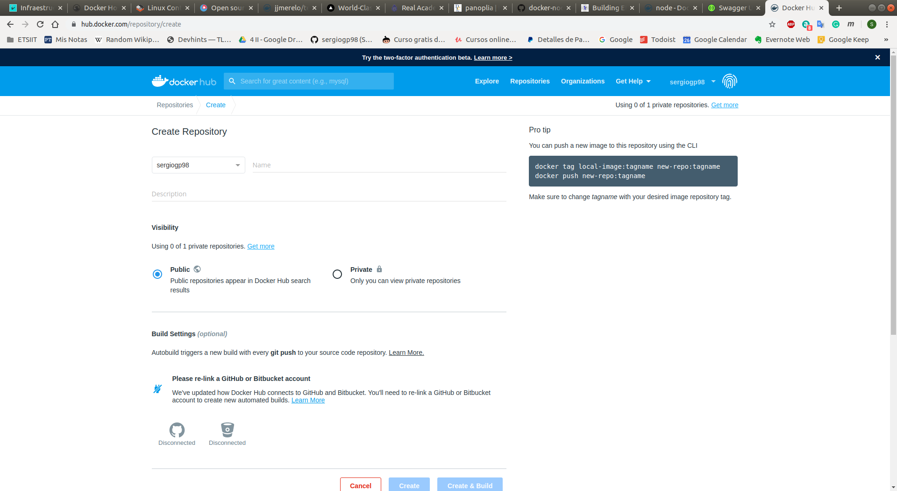
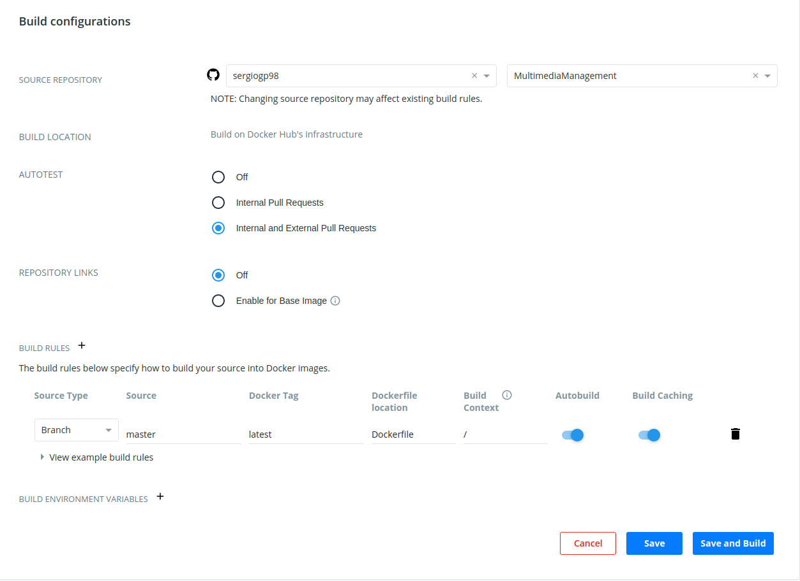
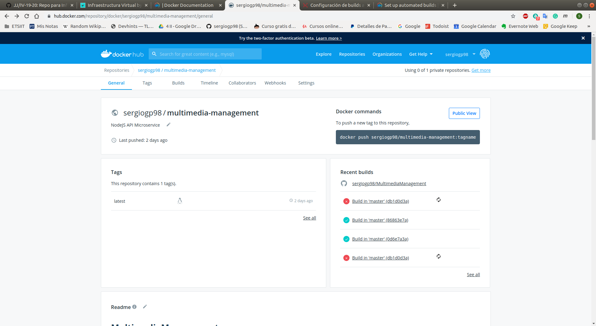
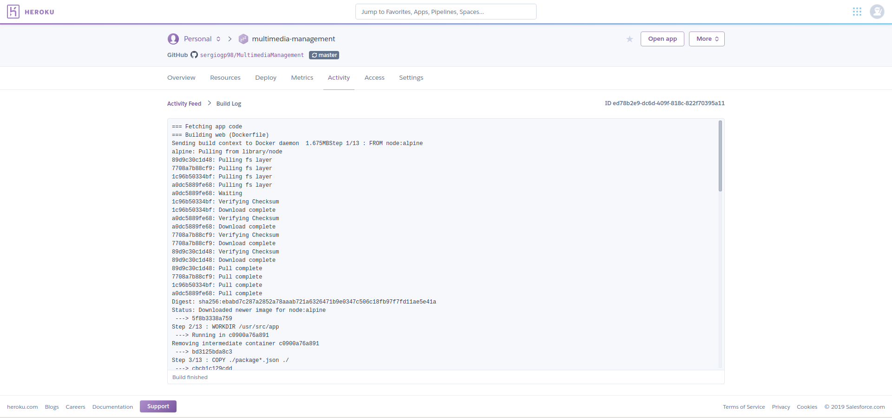
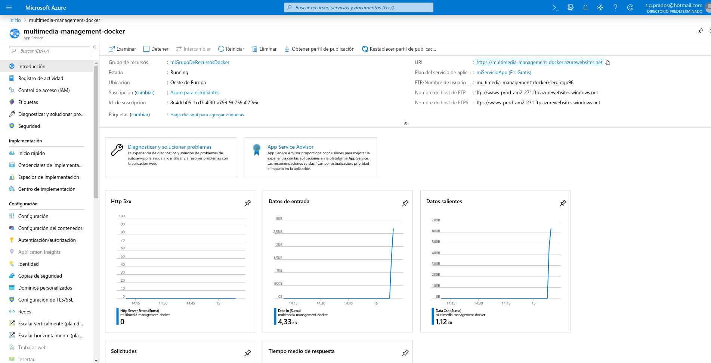

# Contenedores para un microservicio

## ¿Qué es un contenedor?
Si bien las máquinas virtuales (VM) tradicionales permiten la virtualización de la infraestructura de computación, los contenedores habilitan la de las aplicaciones de software. A diferencia de las máquinas virtuales, los contenedores utilizan el sistema operativo (SO) de su host en lugar de proporcionar uno propio.

## ¿Por qué usar contenedores?
Dado que no incluyen sistemas operativos completos, los contenedores requieren recursos informáticos mínimos y son rápidos y fáciles de instalar. Esta eficiencia permite que se implementen en clústeres, con contenedores individuales que encapsulan componentes únicos de aplicaciones complejas. Separar los componentes de la aplicación en diferentes contenedores permite a los desarrolladores actualizar componentes individuales sin necesidad de rehacer la aplicación completa.
Estos contenedores guardan una pila o *stack* (conjunto de aplicaciones) que unidos entre si nos sirve para crear una imagen.

## Docker
Existen múltiples herramientas para virtualizar a nivel de sistema operativo. No obstante, una de las herramienta más usada últimamente es Docker. Docker es un proyecto de código abierto que automatiza el despliegue de aplicaciones dentro de contenedores de software, proporcionando una capa adicional de abstracción y automatización de virtualización de aplicaciones en múltiples sistemas operativos. ​Docker utiliza características de aislamiento de recursos del kernel Linux, tales como cgroups y espacios de nombres (namespaces) para permitir que "contenedores" independientes se ejecuten dentro de una sola instancia de Linux, evitando la sobrecarga de iniciar y mantener máquinas virtuales.2

#### Configuración del Dockerfile
Para desplegar la API en Docker es necesario crear en el directorio raiz del proyecto un Dockerfile. Un Dockerfile es un archivo de texto plano que contiene una serie de instrucciones necesarias para crear una imagen (citado anteriormente) que, posteriormente, se convertirá en una sola aplicación utilizada para un determinado propósito.
En concreto, el Dockerfile de este proyecto consta de las siguientes instrucciones:

```
FROM node:alpine
```
Indica la imagen base sobre la que se construirá la aplicación dentro del contenedor. En concreto, usaré la imagen oficila de NodeJS pero con el *[tag](https://hub.docker.com/_/node)* de *alpine*. Los *tag* son las etiquetas de las imágenes que permite tener una amplia gama la misma imagen. Yo he usado la de *alpine* la cual levanta la imagen sobre el la distribución de Liux *Alpine*.

```
WORKDIR /usr/src/app
```
Indica el directorio de trabajo para las instrucciones de RUN, CMD, ENTRYPOINT, COPY y ADD. Se usa el subdirectorio */usr/src/app*

```
COPY ./package*.json ./
COPY ./controllers ./controllers/
COPY ./helpers ./helpers/
COPY ./middlewares ./middlewares/
COPY ./models ./models/
COPY ./app.js ./
COPY ./modules.js ./
COPY ./docs/swagger.yml ./docs/swagger.yml
```

Copia los archivos exclusivamente necesarios de la primera ruta pasada por argumento a la segunda para que funcionae la API.
* **package.json y package-lock.json**: incluye los archivos de configuración para la herramienta de construcción de NodeJS (npm)
* **controllers**: la implementación de las rutas
* **helpers**: las funciones de la API
* **middlewares**: las funciones necesarias para la correcta ejecución de algunas funciones
* **models**: las funciones relacionadas con el manejo de la base de datos y la definición del esquema de los modelos
* **app.js**: script principal
* **modules.js**: definición de las rutas de todos los archivos
* **swagger.yml**: documentación de las rutas. Necesario para que habilitar la ruta /api-docs

```
EXPOSE $PORT
```

Informa a Docker que el contenedor escucha el puerto pasado por argumento. En concreto le paso la variable de entorno definida en este [archivo](https://github.com/sergiogp98/MultimediaManagement/blob/master/app.js)

```
RUN npm install ci --only=production
```

Ejecuta los comandos pasados como argumento. En concreto indico que se instalen las dependencias necesarias para lanzarlo solo en producción

```
ENTRYPOINT node app.js
```

Permite configurar un contenedor para que se lanze como un ejecutable. Si hay varios, solo tendrá efecto el último. Simplemente ejecuta el script principal

## Docker Hub
[Docker Hub](https://hub.docker.com/) es un repositorio público en la nube, similar a Github, para distribuir los contenidos. Está mantenido por la propia Docker y hay multitud de imágenes, de carácter gratuito, que se pueden descargar y asi no tener que hacer el trabajo desde cero al poder aprovechar “plantillas”.

#### Despliegue y automatización en Docker Hub
Para desplegar el contenedor en Docker Hub es necesario un Dockerfile y una cuenta en Docker Hub.

Tras crearnos una cuenta, accedemos a *Repositories* y crearemos uno donde:
* Indicamos la visibilidad: pública o privada (en mi caso pública)
* Le damos acceso a nuestra cuenta de GitHub para quue al hacer *push* a nuestro repositorio, haga lo mismo en el repositorio de Docker



A continuación, indicamos el respositorio en concreto que queremos subir. Algunos parámetros importantes a configurar:
* **Autotest**: nunca ejecutar los tests, cuand solo haya pull requests internos o pull requests internos y externos. Yo habilité esta última opción
* **Build rules**: cómo construir tu respositorio en una imagen de Docker. Se especifica la rama y el nombre de la misma(*source type* y *source*), la etiqueta de la imagen (*tag*), la localización del Dockerfile (*Dockerfile location*), a partir de qué rama del repositorio construir la imagen (*Build context*), automatizar el despliegue (*Autobuild*), el cual permite hacer *push* al contenedor automáticamente tras hacer *push* en el respositorio y haber pasado los tests y *Build catching* que permite ahorrar tiempo con imágenes pesadas (al inicio, usé la última version de *node* la cual ocupaba mucho)



Una vez creado, tan solo es necesario hacer un *push* a tu respositorio, y si pasa los tests, se creará la imagen.



## Heroku
Heroku provee dos formas de desplegar la API con Docker:
* *Container Registry*: permite desplegar imágenes preconstruidas a Heroku
* Construir la imagen de Docker con un archivo YAML (heroku.yml) para desplegar en Heroku
Usaré la segunda opción ya que ya tengo la imagen de Docker creada. 

#### Configuración del YAML
Para ello se crea un archivo *heroku.yml* en la raiz del directorio del proyecto. Este archivo contiene la siguiente configuración:

```
build:
    docker:
        web: Dockerfile
```

Indicamos la ruta del Dockerfile. En este caso al estar en la raiz del directorio del proyecto, simplemente indicamos el nombre del fichero Dockerfile

```
run:
    web: npm run start-heroku
```

Especificamos el comando a ejecutar para iniciar el contenedor. En este caso ejecuto la misma orden que uso para desplegar la API en Heroku.

#### Despliegue y automatización en Heroku
Para desplegar el contenedor en Heroku, previamente es necesario tener vinculado la cuenta de Hreoku con el repositorio para que cada vez que se haga *push* se despliegue automáticamente en Heroku (explicado en la [documentación de PaaS](https://github.com/sergiogp98/MultimediaManagement/blob/master/docs/paas.md). Una vez vinculado, subimos al repositorio el archivo *heroku.yml*. A continuación ejecutamos la siguiente orden desde la línea de comandos:

```
heroku stacks:set container
```

Esta orden indica que la aplicación en Heroku es un contenedor

Finalmente hacemos *push* al repositorio. Si todo va bien, los logs de despliegue en Heroku deberían de mostrar lo siguiente:



## Azure
Azur permite ejecutar contenedores de Docker sin servidor en Azure con sencillez y velocidad gracias a *Azure Container Instances*. 

Primero creamos un grupo de recursos:

```
az group create --n miGrupoDeRecursosDocker --location "West Europe"
```

Posteriormente se crea un registro de contenedores

```
az acr create -n miContenedorRegistroAzure -g miGrupoDeRecursosDocker --sku Standard --admin-enabled true
```

Se espicifica el nombre, el grupo de recrusos, el tipo de susbscripción y habilitamos la opción de administrador

A continuación secrea el plan de servicio. Para ello ejecutamos la siguiente orden:

```
az appservice plan create -n miServicioApp -g miGrupoDeRecursosDocker --is-linux --sku F1
```

En ella indicamos el nombre dle plan de servicio, el grupo de recursos, worker de Linux, la localización y el tipo de susbscripción

Una vez creado el plan de servicio, se pasa a crear una aplicación web que corra el contenedor de Docker

```
az webapp create -n multimedia-management-docker -g miGrupoDeRecursos -p miServicioApp -i sergiogp98/multimedia-management:latest
```

Se indica el nombre, el grupo de recursos y el plan a usar y el nombre del contenedor en Docker Hub con el tag correspondiente

Si todo va bien, se puede observar la API desplegada:



