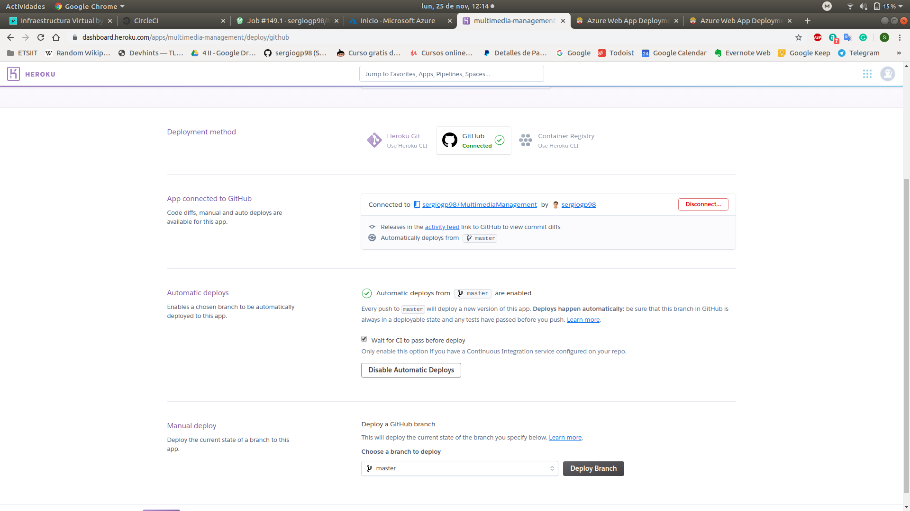
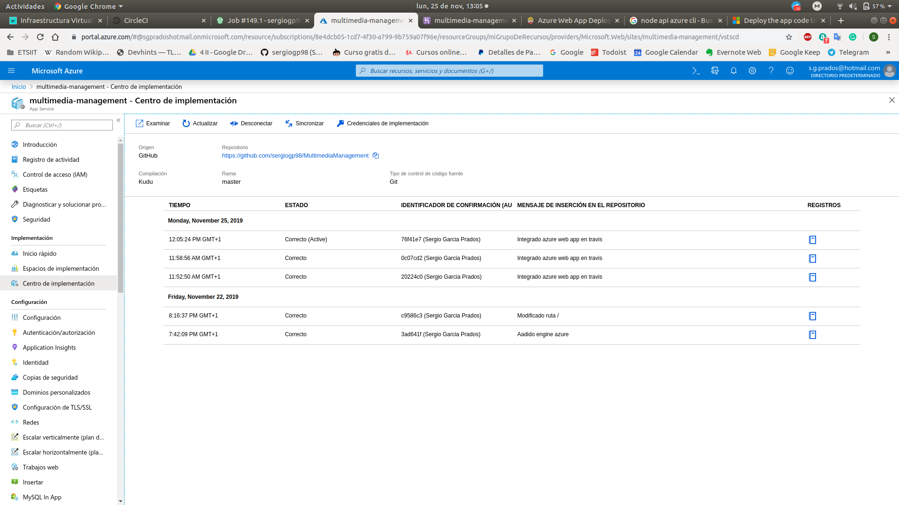

# Despliegue en un  *PaaS* (*Platform as a Service*)

## ¿Qué es un *PaaS*?

Una plataforma como servicio es una oferta de cloud computing que proporciona a los usuarios un entorno de cloud en el que pueden desarrollar, gestionar y distribuir aplicaciones. Además del almacenamiento y otros recursos informáticos, los usuarios pueden utilizar un conjunto de herramientas prediseñadas para desarrollar, personalizar y probar sus propias aplicaciones.

Funciones principales:
* PaaS proporciona una plataforma con herramientas para probar, desarrollar y alojar aplicaciones en el mismo entorno.
* Permite a las organizaciones centrarse en el desarrollo, sin tener que preocuparse por la infraestructura subyacente.
* Los proveedores gestionan la seguridad, los sistemas operativos, el software de servidor y las copias de seguridad.
* Facilita la colaboración incluso si los equipos trabajan en remoto.

En esta API se usa [Heroku](https://www.heroku.com) y [Azure](https://azure.microsoft.com/es-es/). Las siguiente sección explica los pasos y archivos de configuración necesarios para desplegar la API en el correspondiente PaaS.

Nota: esta API se ha desarrollado sobre Ubuntu 18.04 (bionical)

## Heroku

### ¿Por qué Heroku?
Por su simplicidad y facilidad a la hora de añadir el respositorio de deslpiegue y su configuración en un Procfile. Otro de los principales motivos de su elección es el coste económico para usarla, GRATIS.

### ¿Cómo desplegar en Heroku?
Previo a desplegar la API es necesario crear un *Procfile* pero, ¿qué es un 
*Procfile*? Es un archivo de texto plano, el cual tiene que situarse en la carpeta raiz del repositorio, que declara los comandos que deben ser ejecutados para desplegar la API. 

Se compone de declaraciones en el formato: \<proceso>: \<comando> 

```
web: npm run start-heroku
```

* El proceso es el nombre del comando. Existen muchos tipos especiales los cuales estan ya definidos. El proceso *web* es el único que puede recibir tráfico externo HTTP 
* El comando a ejecutar es simplemente la orden del *package.json* que levanta la API

Una vez creado nuestro archivo de configuración, es hora de deplegar la API. Primero hay que instalar la interfaz de linea de comandos de Heroku (CLI) para poder manejar y escalar la API, añadir funcionalidades, ver logs y poder ejecutar la API localmente. Para ello hay que ejecutar desde la linea de comandos:

```
sudo snap install heroku --classic
```

Una vez instalado hay que hacer log in en tu cuenta de Heroku (es necesario un registro previo desde la página web):

```
heroku login
```

En la carpeta del repositorio, tiene que ser necesariamente desde la carpeta raiz, creamos una app en nuestra cuenta de Heroku: 

```
heroku create
```

No obstante, para desplegar esta API, ejecuté la siguiente orden:

```
heroku apps:create --region eu --ssh-git multimedia-management
```

donde:
* *--region eu*: asigna la localización del servidor (Europa)
* *multimedia-management*: asigna el nombre de la app en Heroku. Si no se especifica te asigna un nombre aleatorio. 
* *--ssh-git*: usa SSH como protocolo de transferencia de archivos. Por defecto asigna HTTP. Para poder usar SSH es necesario ejecutar los siguientes comandos:

```
ssh-keygen -t rsa
```

Genera un llave pública en tu máquina (ejecutarlo en caso de no tener una)

```
heroku keys:add
```

Guarda la llave pública en tu entorno de Heroku

Una vez creada la aplicación en Heroku, es necesario asegurarse que al menos una instancia de la API está ejecutandose. Para ello ejecutamos:

```
heroku ps:scale web=1
```

Finalmente accedemos a nuestra API ya desplegada ejecutando:

```
heroku open
```

### Vinculación Github y Heroku
Para configurar Heroku para que cada vez que hagamos *push* a nuestro repositorio también lo suba a nuestro repositorio en Heroku simepre y cuando pases los tests. Para ello hay que ir a API en Heroku -> Desploy y seguir los pasos que te indica



## Azure

### ¿Por qué Azure?
Por su gran potencial y amplia gama de recursos disponibles

### ¿Cómo desplegar en Azure?
Para desplegar en Azure hay dos opciones:
* Desde la interfaz web
* Desde la interfaz de la línea de comandos

En este caso he decidido usar la interfaz de la línea de comandos [CLI](https://docs.microsoft.com/es-es/cli/azure/?view=azure-cli-latest).

Primero es necesario instalar el cliente. Mirar la [documentación](https://docs.microsoft.com/es-es/cli/azure/install-azure-cli?view=azure-cli-latest) para instalarlo según el sistema operativo que uses.

Una vez instalado hay que hacer log in:

```
az login
```

Posteriormente es necesario crear un grupo de recursos y un plan

```
az group create --name myResourceGroup --location westus
```

Con --location indicas la localización del servidor

```
az appservice plan create --name myPlan --sku F1
```

Con --sku indicas el tipo de plan. Mirar los distintos tipos de [planes](https://azure.microsoft.com/en-us/pricing/details/app-service/windows/)

Es hora de crear la aplicación web:

```
az webapp create --name <your_app_name> --plan myPlan --runtime "node|6.9"
```

Con --runtime indicas a Azure la versión de node a usar. Otra forma, la que yo he usado, es escribir en el package.json el siguiente item:

```
"engines": {
    "node": ">10.0.0"
}
```

Una vez creado, hay que configurar tus credenciales de azure mediante la siguiente orden:

```
az webapp deployment user set --user-name <username> --password <password>
```

Finalmente probamos la API ejecutando:

```
az webapp browse --name <your_app_name>
```

Finalmente vinculamos la aplicación web en Azure con nuestro repositorio para que cada vez que hagamos *push* 

### Vinculación Github y Azure

Para configurar Heroku para que cada vez que hagamos *push* a nuestro repositorio también lo suba a nuestro repositorio en Azure simepre y cuando pase los tests. Para ello hay que ir a API en Azure -> App Services -> <your_app_name> -> Centro de implementación -> Github y seguir los pasos indicados



A diferencia de Heroku, en concreto para Travis, hay que configurarlo para que haga *push* en el repositorio de Azure simpre y cuando pase los test (para CircleCI no es necesario ya que lo hace automáticamente).

Primero hay que que instalarse los siguientes paquetes: 
* **ruby** 
* **ruby-dev** 
* **gem**

A continuación nos instalamos el paquete de travis desde el gestor de paquetes de ruby [gem](https://rubygems.org/?locale=es):

```
sudo gem install travis
```

Hacemos log in en nuestra cuenta de travis:

```
travis login`
```

Encriptamos las variables de usuario y contraseña:

```
travis encrypt -r "<username>/<repository>" AZURE_WA_USERNAME="<username>" AZURE_WA_PASSWORD="<password>" --add
```

Con la opción --add indicamos que nos añada al archivo de configuración de Travis una variable de entorno segura con un hash el cual usará para obtener la clave y el usuario. Tendrá el siguiente formato:

```
env:
  global:
    secure: <hash>
```

Y por último indicamos que se despliegue en Azure:

```
deploy:
  provider: azure_web_apps
  site: <your_app_name>
```