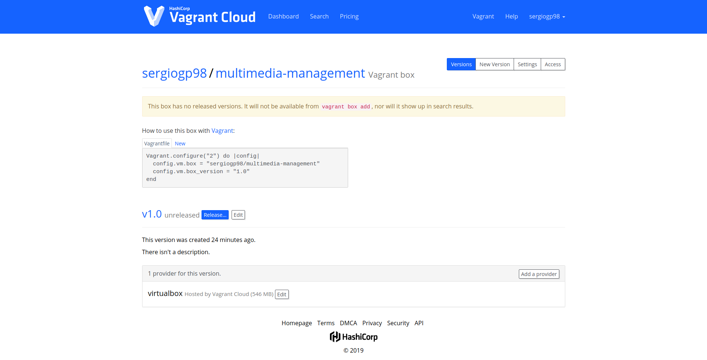

vagrant init ubuntu/bionic64
vagrant up
npm run ansible
vagrant package --output provision/ubuntuVM.box --include .vagrant
 
# Provisionamiento de máquinas virtuales
Para este proyecto voy a usar Vagrant como herramienta para crear una máquina virtual local y Ansible como herramienta de provisionamiento
 
## Vagrant

### Creación de la máquina virtual

Primero instalamos el cliente de Vagrant (desde la línea de comando o el binario de la página web oficial). Yo usaré el de la línea de comandos.
Antes de crear la máquina virtual es necesario usar las llamadas *boxes*. Son imágenes de máquinas virtuales ya creadas las cuales Vagrant las clonará para poder usarlas. Se pueden usar unas ya creadas es este [enlace](https://app.vagrantup.com/boxes/search) o crear manualmente una *box base*. Estas últimas contienen lo mínimo requerido para que Vagrant funcione. Usaré una *box* ya creada: [ubuntu/bionic64](https://app.vagrantup.com/ubuntu/boxes/bionic64)
 
Primero añadimos el archivo *Vagrantfile* a través del comando:
 
```
vagrant init ubuntu/bionic64
```
 
A continuación arrancamos la máquina virtual:
 
```
vagrant up
```
 
Una vez instalada la provisionamos según el archivo *playbook.yml*:
 
```
npm run ansible
```
 
Ir a la sección [Provisionamiento con Ansible](##Provisionamiento-con-Ansible) para entender la estructura del archivo *playbook.yml*
 
 
Finalmente, para exportar la máquina virtual se ejecuta el siguiente comando:
 
```
vagrant package --output provision/ubuntuVM.box --include .vagrant
```
 
Donde *--output* indica la ruta y el nombre del archivo y *--include* para que incluya los ficheros de configuración de la máquina recién creada ubicados de forma predeterminada en el directorio *.vagrant*

### Subir máquina virtual a Vagrant Cloud
Como ya he mencionado antes, Vagrant nos permite usar máquinas virtuales ya predefinidas. Para crear la nuestra primero nos creamos una cuenta en [Vagrant Cloud](https://app.vagrantup.com/session). A continuación pinchamos en *New Vagrant Box*. Especificamos el nombre, su visibilidad y una descricpción de la misma (opcional). Seguidamente, nos aparece un formulario donde inidicar la versión de la misma y una descripción de lo que incluye dicha versión. Pervio a subir el archivo *.box*, indicamos el proveedor, en mi caso *virtualbox*, pinchando en *Add provider*.

Finalmente, para subir la imagen ejecutamos:

```
$ curl 'https://vagrantcloud.com/api/v1/box/USERNAME/BOX_NAME/version/VERSION/provider/PROVIDER_NAME/upload?access_token=ACCESS_TOKEN'
```

El token de acceso lo creamos desde la interfaz web en *nombre_de_usuario -> Security -> Generate token*. En USERNAME, BOX_NAME, VERSION Y PROVIDER_NAME escribimos el nombre de usuario, nombre de la máquina virtual, versión y proveedor previamente indicados respectivamente.

Dicho comando devolverá un JSON con la siguiente información:

```
{
  "upload_path": "https://archivist.hashicorp.com/v1/object/<ID>"
}
```

Donde ID equivale a un identificador único para poder subir el archivo.

Finalmente lo subimos ejecitando:

```
$ curl -X PUT --upload-file <ruta_archivo.box> https://archivist.hashicorp.com/v1/object/<ID>
```

En ella simplemente escribimos la ruta del archivo *.box* a subir seguido del enlace creado anteriormente.

Si todo es correcto, aparecerá en tu perfil la siguiente información:



En ella podemos ver la formas de usar la máquina virtual:

```
Vagrant.configure("2") do |config|
  config.vm.box = "sergiogp98/multimedia-management"
  config.vm.box_version = "1.0"
end
```

Escribiendolo en el archivo *Vagrantfile*.

```
vagrant init sergiogp98/multimedia-management --box-version 1.0
vagrant up
```

O desde la línea de comandos

### Comados útiles de Vagrant:
 
```
vagrant ssh
```
 
Nos permite conecta via SSH
 
```
vagrant halt
```
 
Detiene la máquina virtual
 
```
vagrant destroy
```
 
Borra la máquina virtual
 
 
## Provisionamiento con Ansible

### playbook.yml
```
- hosts: vagrantboxes
 become: yes
```
 
Indica el grupo de máquinas a provisionar. Las pertenecientes a *vagrantboxes*
 
```
- name: Instalar curl
 apt:
  pkg: ['curl']
```
 
Insatala el paquete *curl*
 
```
- name: Instalar PPA del paquete nodejs
 shell:
  cmd: curl -sL https://deb.nodesource.com/setup_12.x | sudo -E bash -
```
 
Instala los archivos de paquetes personales de *nodejs*
 
```
- name: Instala paquetes
 apt:
  update_cache: yes
  pkg: ['git', 'nodejs']
```
 
Instala el paquete de *nodejs* y *git*
 
```
- name: Clona repositorio
 git:
  repo: https://github.com/sergiogp98/MultimediaManagement.git
  dest: $HOME/MultimediaManagement
```
 
Clona el repositorio en la carpeta indicada en *dest*. Al no crear ningún usuario, la crea en la carpeta */root*
 
```
- name: Instalar paquetes según el archivo package.json
 npm:
  path: $HOME/MultimediaManagement
```
 
Instala los paquetes de producción necesarios para lanzar la API
 
### ansible.cfg

```
inventory      = hosts
```

Ruta del archivo de máquinas a provisionar

```
command_warnings = False
```

Evita salida del warnings innecesarios

### hosts

```
[vagrantboxes]
multimedia-management

[vagrantboxes:vars]
ansible_ssh_host=127.0.0.1
ansible_ssh_user=vagrant
ansible_ssh_port=2222
ansible_ssh_private_key_file=../.vagrant/machines/default/virtualbox/private_key
```

Indicamos el nombre de la máquina virtual y la configuración necesaria para conectarse vía ssh